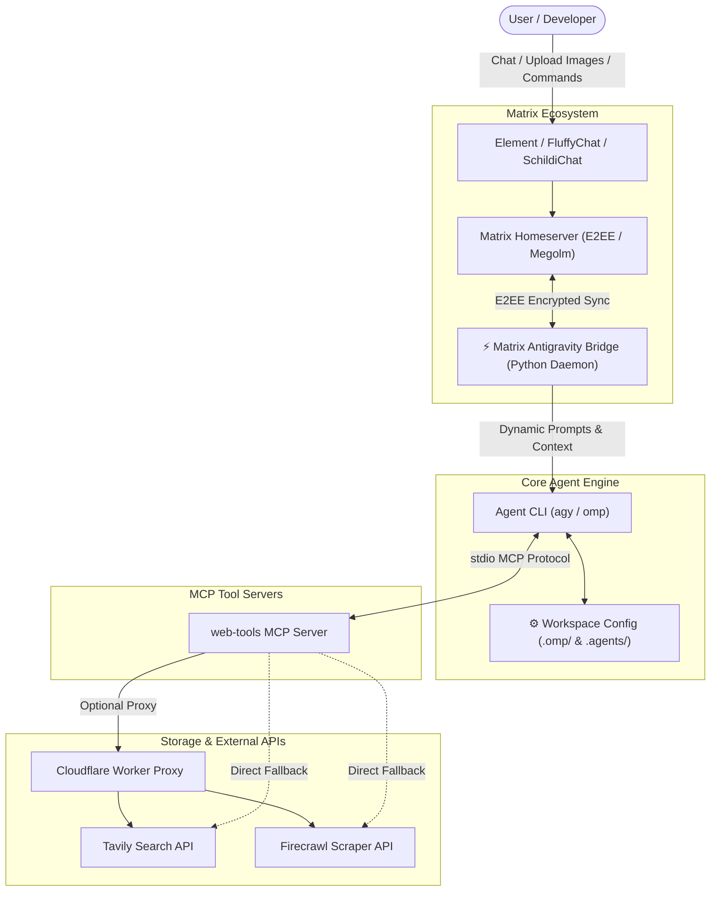

<div align="center">

# ⚡️ Antigravity Nexus

### Autonomous AI Agent Workspace & Ecosystem
**End-to-End Encrypted Matrix Bridge • Model Context Protocol (MCP) Tools**

[](https://github.com/surtr85)
[](https://nodejs.org)
[](https://python.org)
[](https://matrix.org)
[](https://modelcontextprotocol.io)
[](LICENSE)

</div>

---

##  Overview

**Antigravity Nexus** is a production-ready, highly extensible development workspace designed around autonomous AI coding agents (**Google Antigravity / `agy`** and **Oh My Pi / `omp`**). It bridges local AI assistants to external platforms and tools:

1.  **Matrix E2EE Chat Bridge**: Securely communicate with and control your AI agents from any Matrix client (Element, FluffyChat, Cinny) with on-the-fly multimodal image decryption, real-time typing indicators, and slash commands.
2.  **Web Tools MCP Server**: Real-time web intelligence using **Tavily Search** and **Firecrawl Scraper**, with an included **Cloudflare Worker reverse proxy** for restricted network environments.

---

## ️ System Architecture



---

##  Repository Structure

```
antigravity-nexus/
├── README.md                      # Master repository documentation
├── .gitignore                     # Global rules (ignores .env, keys, DBs, venvs)
├── .agents/
│   └── mcp_config.json            # Model Context Protocol servers configuration
├── .omp/
│   └── mcp.json                   # Oh My Pi MCP server configuration
├── matrix/
│   ├── README.md                  # Matrix bridge dedicated documentation
│   ├── matrix_antigravity_bridge.py # Main Python Matrix bridge daemon
│   ├── run_bridge.sh              # Bridge launcher script (auto-loads .env)
│   ├── setup.sh                   # 1-click automated installation & systemd setup
│   ├── requirements.txt           # Python dependencies
│   ├── .env.example               # Template environment configuration
│   ├── .env                       # Local secrets (ignored by git)
│   ├── store/                     # E2EE session & device key database (ignored)
│   └── uploads/                   # Temporary decrypted media cache (ignored)
├── mcp-servers/
│   └── web-tools/                 # Real-time search & scraping MCP server
│       ├── README.md              # web-tools documentation
│       ├── worker.js              # Cloudflare Worker proxy script
│       ├── package.json           # Node.js dependencies
│       ├── src/index.mjs          # Server source code (Tavily & Firecrawl)
│       └── .env.example           # Template API keys
└── tools/                         # User & workspace automation utilities
```

---

##  Dedicated Documentation Index

For in-depth configuration, CLI commands, and architecture details for each module, explore their dedicated guides:

| Module | Dedicated Guide | Description |
| :--- | :--- | :--- |
| ⚡️ **Matrix Chat Bridge** | [ `matrix/README.md`](./matrix/README.md) | E2EE encryption, vision pipeline, slash commands, systemd daemon. |
|  **Web Tools MCP** | [ `mcp-servers/web-tools/README.md`](./mcp-servers/web-tools/README.md) | Tavily search, Firecrawl scraping, Cloudflare Worker proxy (`worker.js`). |

---

##  Core Features & Modules

### 1. ⚡️ Matrix E2EE Chat Bridge (`matrix/`)

Connect your agent directly to any Matrix client (Element, FluffyChat, Cinny, etc.) to pair-program and run tasks from your phone or desktop:

-  **End-to-End Encryption (E2EE)**: Full support for encrypted Matrix rooms via `vodozemac` Megolm ratchets.
- ️ **Multimodal Vision**: Upload screenshots or images directly in chat; the bridge downloads, decrypts, and feeds them to the agent.
-  **Real-time UX**: Live typing indicators (`typing...`) and message status reactions (`⚙️` processing, `✅` completed).
-  **Dynamic Directory Switching**: Change working directory on the fly via `/dir` without losing conversation memory.
-  **Daemonized Service**: Pre-configured user `systemd` unit with automatic restart on boot.

 **[ View Dedicated Matrix Bridge Guide & Setup →](./matrix/README.md)**

#### ⚡️ Matrix Slash Commands Reference

| Command | Aliases | Description |
|---|---|---|
| **`/help`** | `/commands` | Display detailed command reference manual. |
| **`/stop`** | `/cancel`, `/interrupt` | Immediately cancel and interrupt the currently running agent task. |
| **`/dir [path]`** | `/cd`, `/pwd`, `/workspace` | View or switch active workspace directory without resetting memory. |
| **`/new`** | `/reset`, `/clear` | Reset and start a fresh conversation session for this room. |
| **`/model [name]`** | `/models` | View active model or switch models (e.g., `/model claude-sonnet-4-6`). |
| **`/system [prompt]`** | `/persona` | View or set custom system instructions / persona per room. |
| **`/tools [on\|off]`** | `/tool` | Toggle workspace tool execution permissions from chat. |
| **`/usage`** | `/quota`, `/stats` | Display room session info and visual progress bars for account quota. |
| **`/skills`** | `/skill` | List all installed agent skills and automation workflows. |
| **`/mcp`** | `/mcps` | List active Model Context Protocol (MCP) servers and tools. |

---

### 2.  Web Tools MCP Server (`mcp-servers/web-tools/`)

Equips agents with real-time web awareness and scraping capabilities:

-  **`tavily_search`**: AI-optimized web search engine returning relevant snippets, URLs, and instant summaries.
- ️ **`firecrawl_scrape`**: Converts raw webpage URLs into clean, LLM-ready markdown (stripping ads, navbars, and headers).
- ️ **Cloudflare Worker Proxy (`worker.js`)**: Included Cloudflare Worker script that can be deployed for free to proxy API calls in restricted network environments.

 **[ View Dedicated Web Tools & Cloudflare Proxy Guide →](./mcp-servers/web-tools/README.md)**

---

##  Quickstart Guide (New Machine Setup)

### Step 1: Clone the Repository
```bash
git clone https://github.com/surtr85/antigravity-nexus.git
cd antigravity-nexus
```

### Step 2: Install Web Tools MCP Dependencies
```bash
cd mcp-servers/web-tools
npm install
cp .env.example .env
cd ../..
```

### Step 3: Configure and Start the Matrix Bridge
```bash
cd matrix
cp .env.example .env
nano .env   # Enter your Matrix Homeserver, Username, and Password

# Run 1-click automated setup
./setup.sh
```

---

## ⚙️ Environment Variables Summary

### Matrix Bridge (`matrix/.env`)
```env
MATRIX_HOMESERVER=https://matrix.example.com
MATRIX_USERNAME=your_bot_username
MATRIX_PASSWORD=your_bot_password

# Access Control: Only users in this allowlist can interact with or invite the bot
MATRIX_ALLOWED_USERS=@your_username:matrix.example.com

# Matrix Recovery Key for E2EE Key Backup & Automated Cross-Signing Self-Verification (SSSS)
MATRIX_RECOVERY_KEY="EsTc jETz kP1Y 5Xcm NDs3 Gvp3 HkgQ SHz7 FPLJ x5D7 5z6S mv6y"

# Optional overrides:
# DEFAULT_WORKSPACE=/path/to/antigravity-nexus
# AGY_BIN=/path/to/agy
```

### Web Tools (`mcp-servers/web-tools/.env`)
```env
TAVILY_API_KEY=your_tavily_api_key
FIRECRAWL_API_KEY=your_firecrawl_api_key
# PROXY_URL=https://your-worker.workers.dev
```

---

##  Deploying the Cloudflare Worker Proxy

To proxy `web-tools` API calls through Cloudflare Workers:

1. Log in to [Cloudflare Dashboard](https://dash.cloudflare.com) → **Workers & Pages** → **Create Application**.
2. Paste the contents of [`mcp-servers/web-tools/worker.js`](mcp-servers/web-tools/worker.js).
3. Click **Deploy**.
4. Copy the Worker URL (`https://your-worker.workers.dev`) and set `PROXY_URL=https://your-worker.workers.dev` in `mcp-servers/web-tools/.env`.

---

## ️ Security & Privacy Guarantee

-  **Zero Hardcoded Secrets**: All tokens, API keys, passwords, and private paths are strictly loaded from local `.env` files.
-  **Exhaustive `.gitignore`**: Virtual environments, key stores, SQLite journals, downloaded media, and secret configs are barred from version control.
-  **Isolated Encryption Store**: Matrix Megolm keys and SQLite caches remain strictly on the host machine.

---

##  Author & Maintainer

Created & maintained by **[Surtr](https://github.com/surtr85)**.

---

##  License

This project is licensed under the **MIT License** - see the [LICENSE](LICENSE) file for details.
