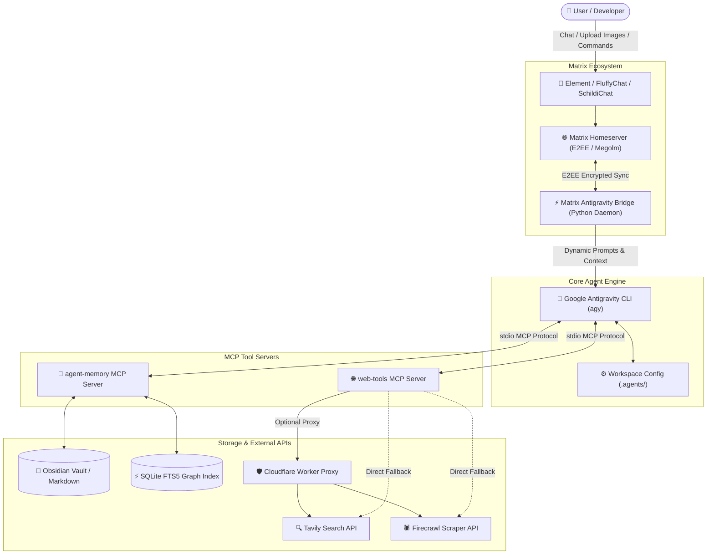

# ⚡️ Antigravity Workspace & AI Agent Ecosystem

A production-grade, extensible multi-agent development environment powered by **Google Antigravity (`agy`)**, featuring an **End-to-End Encrypted (E2EE) Matrix chat bridge**, **Obsidian-backed persistent memory**, and **Model Context Protocol (MCP)** search & scraping tools.

---

## 🏛️ System Architecture



---

## 📁 Repository Structure

```
workspace/
├── README.md                      # Master repository documentation (this file)
├── .gitignore                     # Global rules (ignores .env, keys, DBs, venvs)
├── .agents/
│   └── mcp_config.json            # Model Context Protocol servers configuration
├── matrix/
│   ├── README.md                  # Matrix bridge dedicated documentation
│   ├── matrix_antigravity_bridge.py # Main Python Matrix-to-Antigravity bridge
│   ├── run_bridge.sh              # Bridge launcher script (auto-loads .env)
│   ├── setup.sh                   # 1-click automated installation & systemd setup
│   ├── requirements.txt           # Python dependencies
│   ├── .env.example               # Template environment configuration
│   ├── .env                       # Local secrets (ignored by git)
│   ├── store/                     # E2EE session & device key database (ignored)
│   └── uploads/                   # Temporary decrypted media cache (ignored)
├── mcp-servers/
│   ├── agent-memory/              # Persistent memory server backed by Obsidian
│   │   ├── README.md              # agent-memory documentation
│   │   ├── package.json           # Node.js dependencies
│   │   ├── tsconfig.json          # TypeScript build configuration
│   │   ├── src/                   # TypeScript source code (FTS5, Graph, Tools)
│   │   ├── dist/                  # Compiled JavaScript bundle
│   │   └── obsidian/              # Obsidian Markdown Knowledge Graph Vault
│   │       ├── .obsidian/         # Obsidian appearance & plugin configs
│   │       └── Agent Memory/      # Structured memory categories
│   │           ├── Decisions/     # Architectural decisions
│   │           ├── Experiences/   # Interaction logs & trials
│   │           ├── Facts/         # Verified user & system facts
│   │           ├── Lessons/       # Extracted learnings
│   │           ├── Patterns/      # Recurring development patterns
│   │           ├── Preferences/   # User preferences & personas
│   │           ├── Problems/      # Solved bugs & failure analyses
│   │           ├── Projects/      # Project tracking & layouts
│   │           ├── Sessions/      # Chat transcripts & milestones
│   │           └── Skills/        # Verified execution guides
│   └── web-tools/                 # Real-time search & scraping MCP server
│       ├── README.md              # web-tools documentation
│       ├── worker.js              # Cloudflare Worker proxy script
│       ├── package.json           # Node.js dependencies
│       ├── src/index.mjs          # Server source code (Tavily & Firecrawl)
│       └── .env.example           # Template API keys
└── tools/                         # User & workspace automation utilities
```

---

## 📚 Documentation Index

For in-depth setup, CLI commands, and architecture details for each module, explore their dedicated guides:

| Module | Dedicated Guide | Description |
| :--- | :--- | :--- |
| ⚡️ **Matrix Chat Bridge** | [📖 `matrix/README.md`](./matrix/README.md) | E2EE encryption, vision pipeline, slash commands, systemd daemon. |
| 🧠 **Agent Memory MCP** | [📖 `mcp-servers/agent-memory/README.md`](./mcp-servers/agent-memory/README.md) | Obsidian vault schema, FTS5 retrieval, memory promotion lifecycle. |
| 🌐 **Web Tools MCP** | [📖 `mcp-servers/web-tools/README.md`](./mcp-servers/web-tools/README.md) | Tavily search, Firecrawl scraping, Cloudflare Worker proxy (`worker.js`). |

---

## 🌟 Core Features & Modules

### 1. ⚡️ Matrix E2EE Chat Bridge (`matrix/`)

Connect your Antigravity agent directly to any Matrix client (Element, FluffyChat, Cinny, etc.) to pair-program and run tasks from your phone or desktop:

- 🔐 **End-to-End Encryption (E2EE)**: Full support for encrypted Matrix rooms via `vodozemac` Megolm ratchets.
- 🖼️ **Multimodal Vision**: Upload screenshots or images directly in chat; the bridge downloads, decrypts, and feeds them to Antigravity.
- 💬 **Real-time UX**: Live typing indicators (`typing...`) and message status reactions (`⚙️` processing, `✅` completed).
- 🧠 **Dynamic Directory Switching**: Change working directory on the fly via `/dir` without losing conversation memory.
- 🛠 **Daemonized Service**: Pre-configured user `systemd` unit with automatic restart on boot.

👉 **[📖 View Dedicated Matrix Bridge Guide & Setup →](./matrix/README.md)**

#### ⚡️ Matrix Slash Commands Reference

| Command | Aliases | Description |
|---|---|---|
| **`/help`** | `/commands` | Display detailed command reference manual. |
| **`/stop`** | `/cancel`, `/interrupt` | Immediately cancel and interrupt the currently running agent task. |
| **`/dir [path]`** | `/cd`, `/pwd`, `/workspace` | View or switch active workspace directory without resetting memory. |
| **`/new`** | `/reset`, `/clear` | Reset and start a fresh conversation session for this room. |
| **`/model [name]`** | `/models` | View active model or switch models (e.g., `/model claude-sonnet-4-6`). |
| **`/system [prompt]`** | `/persona` | View or set custom system instructions / persona per room. |
| **`/tools [on\|off]`** | `/tool` | Toggle workspace tool execution permissions from chat. |
| **`/usage`** | `/quota`, `/stats` | Display room session info and visual progress bars for account quota. |
| **`/skills`** | `/skill` | List all installed Antigravity skills and automation workflows. |
| **`/mcp`** | `/mcps` | List active Model Context Protocol (MCP) servers and tools. |

---

### 2. 🧠 Agent Memory MCP Server (`mcp-servers/agent-memory/`)

A high-performance long-term memory system where **Obsidian Markdown files are the single source of truth**, indexed by an embedded **SQLite FTS5 + Graph** engine:

- 📚 **10 Categorized Memory Types**: `Facts`, `Preferences`, `Decisions`, `Experiences`, `Lessons`, `Patterns`, `Skills`, `Problems`, `Projects`, and `Sessions`.
- 🔍 **Hybrid Retrieval**: Combines FTS5 BM25 relevance, title weighting, status filtering, recency boosting, and Obsidian wikilink graph connectivity.
- 🔄 **Autonomous Memory Lifecycle**:
  - `memory_remember`: Stores memories with automated semantic deduplication.
  - `memory_promote`: Elevates knowledge (`Experience → Lesson → Pattern → Skill`) while maintaining provenance.
  - `memory_consolidate`: Detects contradictions, duplicate notes, and stale entries.
- ⚡️ **Zero Data Lock-in**: All memories are standard human-readable Markdown notes that can be edited in Obsidian.

👉 **[📖 View Dedicated Agent Memory MCP Guide & CLI Tools →](./mcp-servers/agent-memory/README.md)**

---

### 3. 🌐 Web Tools MCP Server (`mcp-servers/web-tools/`)

Equips Antigravity with real-time web awareness and scraping capabilities:

- 🔍 **`tavily_search`**: AI-optimized web search engine returning relevant snippets, URLs, and instant summaries.
- 🕷️ **`firecrawl_scrape`**: Converts raw webpage URLs into clean, LLM-ready markdown (stripping ads, navbars, and headers).
- 🛡️ **Cloudflare Worker Proxy (`worker.js`)**: Included Cloudflare Worker script that can be deployed for free to proxy API calls in restricted network environments.

👉 **[📖 View Dedicated Web Tools & Cloudflare Proxy Guide →](./mcp-servers/web-tools/README.md)**

---

## 🚀 Quickstart Guide (New Machine Setup)

### Step 1: Clone the Repository
```bash
git clone ssh://git@git.surtr.ir:2222/amadeus/workspace.git
cd workspace
```

### Step 2: Install Node.js MCP Dependencies
```bash
# Install Web Tools dependencies
cd mcp-servers/web-tools
npm install
cp .env.example .env

# Install and build Agent Memory
cd ../agent-memory
npm install
npm run build
cp .env.example .env
cd ../..
```

### Step 3: Configure and Start the Matrix Bridge
```bash
cd matrix
cp .env.example .env
nano .env   # Enter your Matrix Homeserver, Username, and Password

# Run 1-click automated setup
./setup.sh
```

---

## ⚙️ Environment Variables Summary

### Matrix Bridge (`matrix/.env`)
```env
MATRIX_HOMESERVER=https://matrix.example.com
MATRIX_USERNAME=your_bot_username
MATRIX_PASSWORD=your_bot_password
# DEFAULT_WORKSPACE=/path/to/workspace
# AGY_BIN=/path/to/agy
```

### Web Tools (`mcp-servers/web-tools/.env`)
```env
TAVILY_API_KEY=your_tavily_api_key
FIRECRAWL_API_KEY=your_firecrawl_api_key
# PROXY_URL=https://your-worker.workers.dev
```

### Agent Memory (`mcp-servers/agent-memory/.env`)
```env
OBSIDIAN_VAULT=./obsidian
MEMORY_LOG_LEVEL=info
MEMORY_EMBEDDINGS=disabled
```

---

## 🌐 Deploying the Cloudflare Worker Proxy

To proxy `web-tools` API calls through Cloudflare Workers:

1. Log in to [Cloudflare Dashboard](https://dash.cloudflare.com) → **Workers & Pages** → **Create Application**.
2. Paste the contents of [`mcp-servers/web-tools/worker.js`](mcp-servers/web-tools/worker.js).
3. Click **Deploy**.
4. Copy the Worker URL (`https://your-worker.workers.dev`) and set `PROXY_URL=https://your-worker.workers.dev` in `mcp-servers/web-tools/.env`.

---

## 🛡️ Security & Privacy Guarantee

- 🔒 **Zero Hardcoded Secrets**: All tokens, API keys, passwords, and private paths are strictly loaded from local `.env` files.
- 🚫 **Exhaustive `.gitignore`**: Virtual environments, key stores, SQLite journals, downloaded media, and secret configs are barred from version control.
- 🔐 **Isolated Encryption Store**: Matrix Megolm keys and SQLite caches remain strictly on the host machine.

---

## 📄 License

MIT License. Feel free to use, modify, and distribute this workspace for your own agentic workflows.
